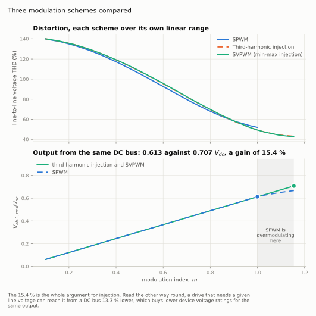
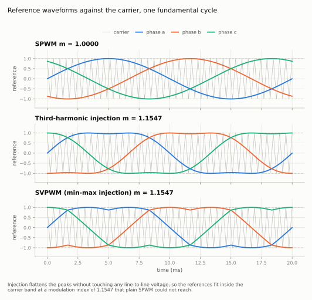
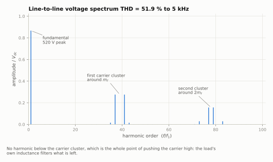
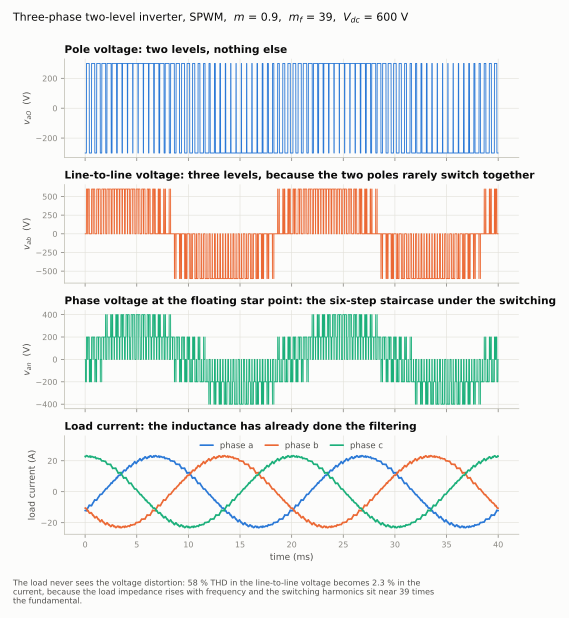

# Three-Phase SPWM Inverter Model

A three-phase two-level voltage source inverter built as a block diagram in
Python: modulator, carrier, comparators, bridge and a wye-connected RL load,
solved together by a fixed-step RK4 engine. The point of the project is the
comparison it makes — sinusoidal PWM against third-harmonic injection against
SVPWM — measured rather than asserted, with the FFT and the THD taken from the
simulated waveform.

Everything runs on a laptop. No hardware, no MATLAB licence, no toolbox.

<picture>
  <source media="(prefers-color-scheme: dark)" srcset="figures/scheme_comparison_dark.svg">
  
</picture>

## The result

| Scheme | Largest linear m | Line-to-line fundamental | V<sub>ab,1,rms</sub> / V<sub>dc</sub> | THD of v<sub>ab</sub> |
|---|---|---|---|---|
| SPWM | 1.0000 | 520.0 V peak | 0.6129 | 51.9 % |
| Third-harmonic injection | 1.1547 | 600.1 V peak | 0.7072 | 43.1 % |
| SVPWM (min-max injection) | 1.1547 | 600.0 V peak | 0.7071 | 42.5 % |

Measured on a 600 V bus at 50 Hz with a carrier at 1950 Hz, THD taken over a
band reaching past the second carrier cluster.

Injection buys **15.4 %** more line voltage from the same DC bus, against a
theoretical 2/√3 = 15.47 %. Read the other way round, a drive that has to reach
a given motor voltage can do it from a bus 13.3 % lower, which means lower
device voltage ratings for the same output. That number is the entire reason
industrial drives do not use plain SPWM.

Both injection schemes land within 0.1 % of each other. SVPWM is usually
presented through sector identification and vector dwell times; the min-max
form here reaches the same output by subtracting the mean of the largest and
smallest of the three references, which is three lines of code and needs no
hexagon.

## Why injection is free

The term that third-harmonic and min-max injection add is common to all three
phases. Two consequences follow, and together they are the whole argument:

- It cancels in every line-to-line voltage, because v<sub>ab</sub> = v<sub>a</sub> − v<sub>b</sub> and the
  common part subtracts away.
- It cannot drive current through a star point that floats, because there is
  no return path for a zero-sequence current.

So it costs nothing at the load, and it buys headroom at the pole: the peaks of
the reference are pulled back inside the carrier band, and a larger fundamental
fits where it previously would not.

<picture>
  <source media="(prefers-color-scheme: dark)" srcset="figures/modulation_dark.svg">
  
</picture>

`verify.py` checks this claim rather than stating it. With third-harmonic
injection at m = 1.1, the third harmonic measured in v<sub>ab</sub> is 0.0009 of the
fundamental — which is the numerical floor, not a residue.

## Where the switching energy goes

<picture>
  <source media="(prefers-color-scheme: dark)" srcset="figures/spectrum_dark.svg">
  
</picture>

There is nothing between the fundamental and the first carrier cluster. That is
the property that makes PWM useful: the distortion is pushed to a frequency the
load's own inductance filters. At m = 0.9 the line-to-line voltage carries
58.3 % THD and the current that results carries **2.26 %**.

The carrier ratio m<sub>f</sub> = 39 was chosen, not accepted. Odd makes the waveform
half-wave symmetric, which removes the even harmonics. A multiple of three puts
the carrier harmonic itself into the zero sequence, where the line-to-line
voltage cannot see it — and the spectrum confirms it, with the line at 39 × f₁
sitting at 0.0009 of the fundamental while its sidebands at 37 and 41 dominate.

<picture>
  <source media="(prefers-color-scheme: dark)" srcset="figures/waveforms_dark.svg">
  
</picture>

## The simulation engine

`blockset/core.py` is about 250 lines and does what a block-diagram simulator
does, because a model that reads like a diagram is easier to argue with than
one written as a loop over time:

- A block declares an output equation and, if it has state, a derivative.
- Execution order comes from a topological sort over the blocks that pass
  their input straight to their output. A block without direct feedthrough is
  what breaks a feedback loop — which is why an algebraic loop is only an error
  when every block in the loop is direct feedthrough.
- Continuous states advance by fixed-step RK4; discrete blocks hold their
  output between their own sample instants. A controller at one rate and a
  power stage at another therefore coexist in one run.

The engine knows nothing about power electronics. The same file is used
unchanged by a sibling project that models a digitally controlled buck
converter.

## Verifying it

Producing plausible-looking waveforms proves nothing. `verify.py` computes
eleven quantities two ways — once from the model, once from an expression that
takes a couple of lines on paper — and exits non-zero if any disagree.

```
$ python3 verify.py
  [pass] V_ab fundamental at m = 0.9
         model    467.64779   theory    467.65372   error  -0.001 %
  [pass] phase current rms
         model     16.17080   theory     16.16573   error  +0.031 %
  [pass] ratio between them
         model      1.15385   theory      1.15470   error  -0.074 %
  ...
11 checks passed, 0 failed
```

The checks cover the fundamental against m·V<sub>dc</sub>·√3/2 at four modulation
indices, the load current against |Z| = √(R² + (ωL)²), both utilisation limits
against √3/(2√2) and 1/√2, the absence of the injected third harmonic from the
line-to-line voltage, and the carrier choice.

## Run it

```bash
pip install numpy scipy matplotlib

python3 verify.py         # the checks above, about 40 s
python3 make_figures.py   # rebuilds every figure from the model, about 90 s
```

Every figure in this README is generated by that second command. None was drawn
by hand, so a change to the model shows up in the pictures instead of quietly
disagreeing with them. Each is written twice, for a light and a dark page.

A single operating point, for experimenting:

```python
from models.inverter_model import InverterParams, simulate

p = InverterParams(vdc=600, f1=50, fc=1950, m=0.9, scheme="svpwm",
                   R=10, L=20e-3)
r = simulate(p, cycles=6)
print(r["v1_ab_peak"], r["thd_vab"], r["thd_ia"])
```

## File layout

```
blockset/core.py             the block-diagram engine: solver, sort, blockset
models/inverter_blocks.py    modulator, carrier comparators, bridge, RL load
models/inverter_model.py     the diagram, wired up, and one run of it
models/sweep.py              the modulation-index sweep, load omitted for speed
models/plotstyle.py          one look for every figure, light and dark
make_figures.py              regenerates figures/
verify.py                    eleven checks against closed-form theory
```

## Deliberate limitations

- **Dead time is not modelled.** Real gate drives insert a blanking interval
  where neither device conducts, and the pole voltage during it is decided by
  the sign of the current. It distorts the output near a current zero crossing
  and is the reason low-speed drive current looks worse than this model
  suggests.
- **Devices are ideal switches.** No on-state drop, no switching loss, so the
  model says nothing about efficiency or heatsinking.
- **The load is a passive RL.** A real motor has a back-EMF that a drive has to
  work against, and the current waveform reflects that.

Each of these is a reason the model is for studying modulation rather than for
sizing a converter, and each is a reasonable next thing to add.
